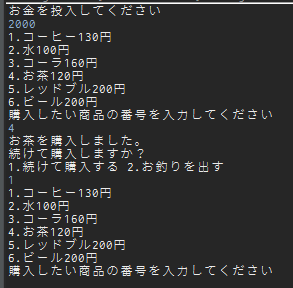

# VendingMachine

# Introduction
自販機を模したJavaのコンソールアプリケーション。<br>
コンソール上の標準入力を利用して、『コインの投入』『商品の陳列』『商品の購入処理』『お釣りの排出』などを行う。<br>
以下、アプリのサンプル。




# Background +

書籍『スッキリわかるJava入門』での学習が終わったが、学んだ内容を利用して何かを表現することに飢えていた。<br>
知識を定着させるという意味でも重要であり、その旨を友人に相談したところ、『自販機を模したコンソールアプリケーションの制作』の課題を受け取った。<br>

また、新たに獲得する知識や技術についても、積極的にソースコードに組み込み、表現していく。


# Qiita / Output

- [クラス型のArrayListから、要素を順に取り出す](https://qiita.com/cordy/items/2dfddd33b8dbebff3907)

# Learning in the repositry

## while true文と標準入力、例外処理を利用して、適切な入力がなされるまでループする仕組みを作成した。*1

  
\*1

try-catchのcatch文は、空白にしておかず、エラー文を出力するように設定する。不具合が発生した場合、原因の特定が難しくなるからである。<br>
　~~ループ文の中で標準入力を用いた際に意図しない入力が行われると、Scannerインスタンスは壊れてしまい、改めて初期化しなければならなくなる。~~<br>
 意図しない入力、例えば"a"が入力されるとScannerクラスのnextInt()メソッドではそれを読み込まない上、『まだ読み込み終わっていないリテラルが存在する』という扱いとなる。<br>
 従って、次に標準入力が行われる時にそのリテラルを読み込もうとしてしまい、意図しない挙動が起きることが分かった。<br>
 Scannerクラスを初期化してもその不具合は解決するが、nextLine()メソッドを使って入力されたリテラルを読み込みきってしまう解決策のほうが、より本質的である。
 
  
## オブジェクト指向に基づき、役割に合わせて3つのクラスを作成した。
  - 『自販機の飲み物のフィールドを持つクラス』*2
  - 『自販機の操作に関するメソッドをまとめたクラス』*3
  - 『メインとなるクラス』*4
  - 『飲み物の性質を決定する列挙型クラス』

<p>
*2
  
  『商品番号』『商品名』『価格』など3つ以上のフィールドを持つオブジェクトでは、連想配列で要素を連結するよりも、コンストラクタを作成し呼び出したほうが効率的である。<br>  
  このとき、以下のようにインスタンスを生成し配列に追加すると可読性が高い。
  
  ```Java
		drinklist.add(new Drink("コーヒー", 130, SOFTDRINK));
		drinklist.add(new Drink("水",100, SOFTDRINK));
    
  ```
  </p>
  <p>
*3
  
  ArrayListもメソッドの引数に入れられることを知った。(ArrayList<型> name)で利用可能。型にはクラス型も入れることができる。<br>
   次に、戻り値が必要な場合、メソッドは単純に記述しただけでは利用できない。returnで値を返す必要がある。<br>
   また、可読性の向上のため、一行で記述できる内容でも分けて記述することにもメリットがある。</p>
  <p>
    例：    
    
```java   
String productName = drinklist.get(choiceNumber).getName();
System.out.println(productName + "を購入しました。");
```

</p>
    
  
  <p>
*4
  
  別クラスにメソッドやオブジェクトの詳細を分離することで、メインクラスを簡略化し、どのような処理が行われているかを理解しやすくした。（可読性の向上を狙った）
  </p>
  <p>
  
## 列挙型を用いて、『アルコール飲料』『ソフトドリンク』のように入力可能な値を2種類に限定するフィールドを作成した。*5

\*5

列挙型を用いる場合、列挙型を使用するクラスそれぞれで列挙型クラスをimportする必要がある。<br>
import static パッケージ名.クラス名.列挙型の値;<br>
と具体的には記述する。複数の列挙型の値を利用する場合(例：ALCOHOL, SOFTDRINK)、そのそれぞれの値をimportしなければならない。<br>
あるいは、
import static パッケージ名.クラス名.\*;
とすることで全ての値をimportしたことにもできる。


  
  </p>
<p>  
  
## その他
  - if文の条件式について、boolean型変数であれば if(hoge) やif(!foo) などで論理値を表現できるが、<br>
  "!"の見落としの可能性を考え、if(foo == false)などとした。
</p>

# Development environment
JDK 10.0.2
